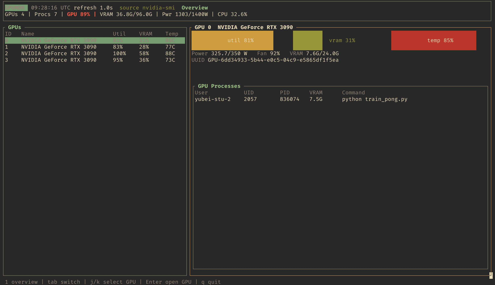
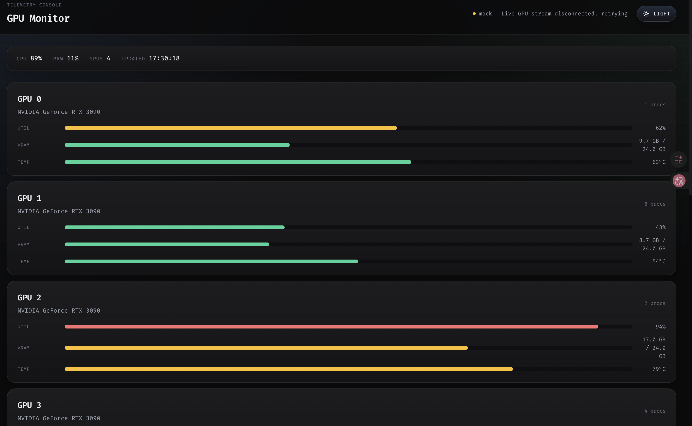

# GPU Monitor

> You can use AI to translate or explain this document and the rest of the project's documentation in your preferred language.
>
> 你可以使用 AI 将本文档和本项目的其他文档翻译成你偏好的语言，或为你解读其中的内容。

GPU Monitor is a small NVIDIA GPU dashboard. It ships as a Rust binary with a React web UI and reads live metrics from `nvidia-smi`.

## Demo

`gpu-monitor tiu` opens an interactive TUI:



`gpu-monitor web` opens an interactive web page:



## Requirements

- Rust 1.80 or newer
- Node.js 20 or newer
- NVIDIA drivers with `nvidia-smi`

## Install And Update

```bash
./install.sh
```

That command installs the local project build. It does two things:

1. Builds the React dashboard in `app/dist`.
2. Builds the Rust release binary in `target/release/gpu-monitor`.

The root `./gpu-monitor` launcher then runs that release binary.

To update an existing checkout after pulling new code, run the same installer again:

```bash
git pull
./install.sh
```

Run `./install.sh` whenever Rust code, frontend code, or frontend dependencies change. The `web` command can rebuild the frontend when `app/dist` is missing or stale, but `./install.sh` is the clean full rebuild path.

## Use

Start the dashboard:

```bash
./gpu-monitor web
```

Then open the printed URL, usually:

```text
http://127.0.0.1:8766/
```

The command starts both the WebSocket metric stream and the web dashboard. If the default WebSocket port `8765` is already busy, it automatically picks a free port and connects the page to it.

Useful options:

```bash
./gpu-monitor web --web-port 8770
./gpu-monitor web --port 9000
./gpu-monitor web --font "Fira Code"
./gpu-monitor web --font-css "https://fonts.googleapis.com/css2?family=Fira+Code:wght@400;500;600;700&display=swap"
./gpu-monitor tui
./gpu-monitor server --host 0.0.0.0 --port 8765
```

TUI controls:

- `j` / Down: select next GPU
- `k` / Up: select previous GPU
- Tab / Left / Right: switch between Overview and Processes
- `1`: Overview
- `2`: Processes
- `q`, Esc, or Ctrl+C: quit

The dashboard uses `Fira Code` by default. If it is not installed locally, the browser loads it through a lightweight font CSS URL. You can choose another font with either:

```bash
./gpu-monitor web --font "JetBrains Mono"
GPUMON_FONT="IBM Plex Mono" ./gpu-monitor web
```

Use `--font-css` or `GPUMON_FONT_CSS` to point at another CSS file, for example an internal mirror. Use an empty value to disable remote font loading:

```bash
./gpu-monitor web --font "JetBrains Mono" --font-css "https://fonts.googleapis.com/css2?family=JetBrains+Mono:wght@400;500;600;700&display=swap"
GPUMON_FONT_CSS="" ./gpu-monitor web
```

## Data

GPU table:

- `util`: GPU utilization percentage reported by `nvidia-smi`
- `vram`: used / total GPU memory
- `temp`: current GPU temperature
- `power`: current power draw / enforced power limit
- `processes`: number of GPU compute processes currently attached to that GPU

Process table:

- `GPU`: GPU index that owns the process
- `PID`: operating-system process id
- `User`: username resolved from UID when available
- `UID`: numeric user id
- `Type`: `C` means compute process
- `VRAM`: GPU memory used by the process
- `Command`: full process command line when available

Bottom status:

- `avg temp`: average temperature across GPUs
- `sum power`: sum of current power draw across GPUs
- `sum vram`: sum of used VRAM across GPUs
- `sum capacity`: sum of total VRAM capacity across GPUs
- `system cpu`: current host CPU utilization
- `system mem`: current host memory utilization

Resource chart:

- `cpu`: current host CPU utilization
- `mem`: current host memory utilization
- `gpu N`: utilization percentage for GPU `N`, not VRAM usage

## Development

```bash
cargo fmt --check
cargo check

cd app
npm run lint
npm run build
```

For frontend-only development, start the metric stream and Vite separately:

```bash
./gpu-monitor server --port 8765

cd app
npm run dev
```

## Documentation

- [CLI](docs/cli.md)
- [Design](docs/design.md)
- [Workflows](docs/workflows.md)

## License

MIT
